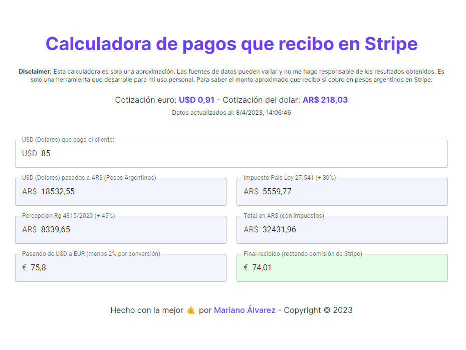

# Calculadora de pagos que recibo en Stripe

Esta calculadora es solo una aproximación. Las fuentes de datos pueden variar y no me hago responsable de los resultados obtenidos. Es solo una herramienta que desarrolle para mi uso personal. Para saber el monto aproximado que recibo si cobro en pesos argentinos en Stripe.

Utilice React y TailwindCSS para el desarrollo, Vitejs como bundler y PHP para escrapear los datos de una de las cotizaciones de la cual no tengo acceso a la API.

## Pantallazo

## Colaboración

Si queres colaborar con el proyecto, podes hacerlo de las siguientes maneras:

-   Haciendo un fork del proyecto y enviando un pull request.
-   Creando un issue en el repositorio.
-   Contactandome por [Twitter](https://twitter.com/dev_creativoma).

## Licencia

MIT License - Copyright (c) 2023 Mariano Álvarez
